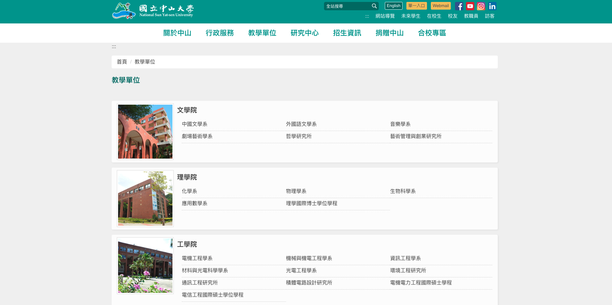
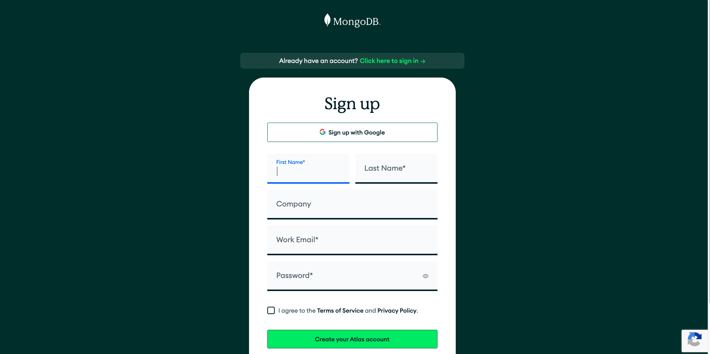
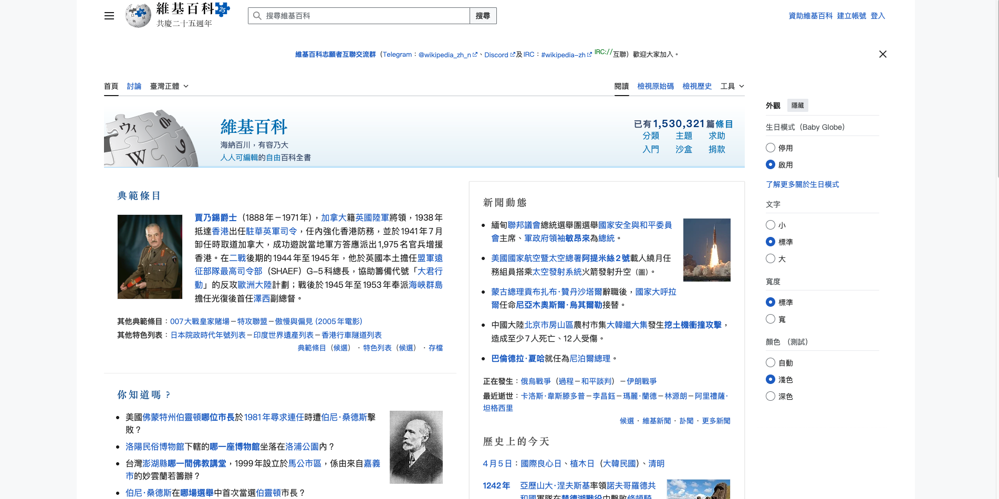
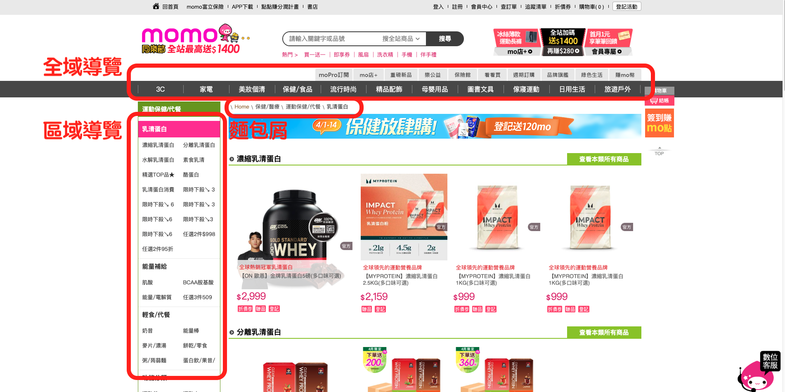
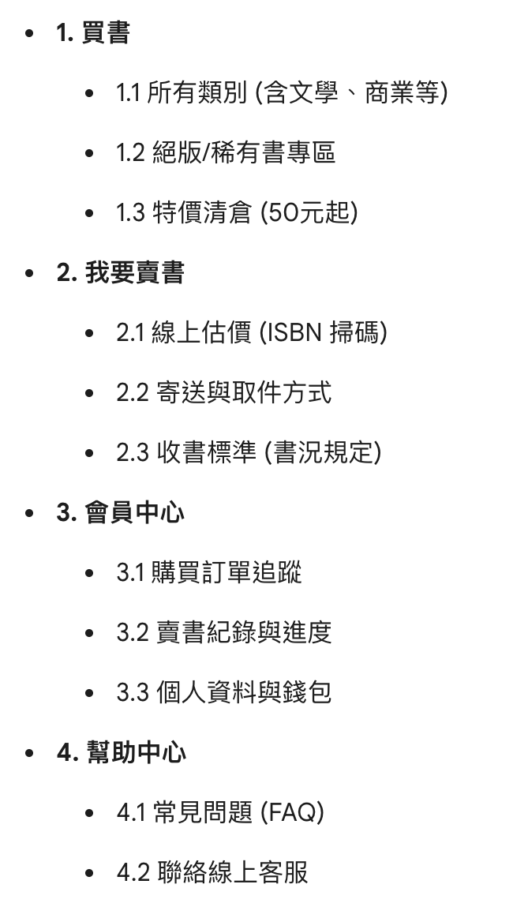

# 資訊架構與流程圖
## Information Architecture & Flow Chart

許智超
cchsu@mail.nsysu.edu.tw

---

### 什麼是資訊架構 (Information Architecture)?

資訊架構是指如何組織、結構化及標記網站或應用程式的內容，以便使用者能有效地找到資訊並完成任務。

- 組織系統 (Organization Systems)
- 標籤系統 (Labeling Systems)
- 導覽系統 (Navigation Systems)
- 搜尋系統 (Search Systems)

---

### 資訊架構的四種基本結構

1. **層級式結構 (Hierarchical)**
   - 最常見的結構。
   - 由上而下的樹狀結構。
   - 適合處理大量且複雜的資訊。

---

### 資訊架構的四種基本結構

2. **線性結構 (Sequential)**
   - 引導使用者按照特定步驟完成任務。
   - 常見於結帳流程或註冊表單。

---

### 資訊架構的四種基本結構

3. **矩陣式結構 (Matrix)**
   - 允許使用者從多個維度進行篩選。
   - 例如電商網站的分類篩選（顏色、大小、價格）。

---

### 資訊架構的四種基本結構

4. **網路式結構 (Network)**
   - 項目之間透過連結互相交織。
   - 例如維基百科或社群媒體。

---

### 導覽系統 (Navigation Systems)

- 全域導覽 (Global Navigation)
- 區域導覽 (Local Navigation)
- 關聯性導覽 (Contextual Navigation)
- 輔助導覽 (Supplemental Navigation)

---

### 測試資訊架構：樹狀測試 (Tree Testing)

- 評估使用者是否能在現有的階層結構中找到目標。
- 排除視覺設計的干擾。
- 測試組織、標籤的可理解性。

---

# 謝謝觀看

Q&A
