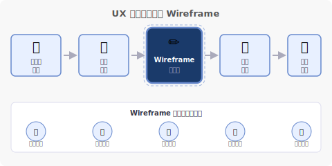
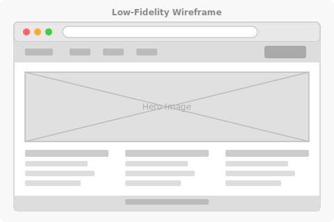
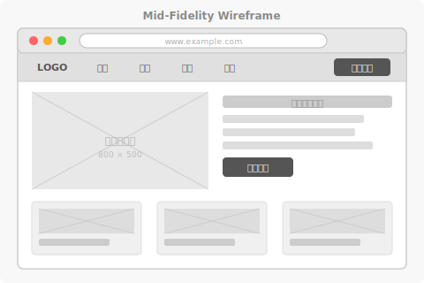
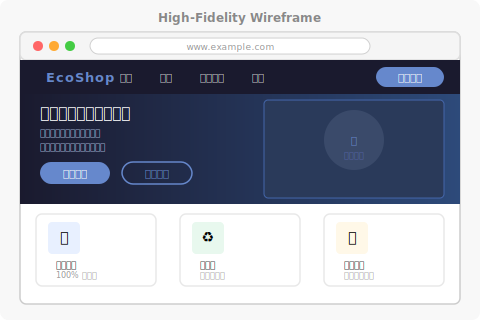
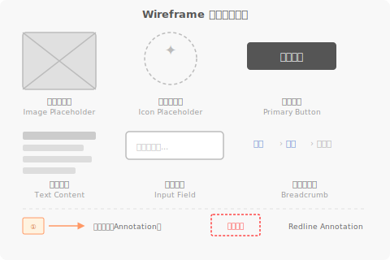
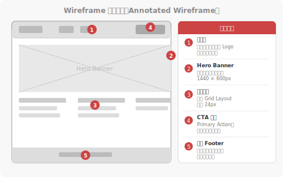
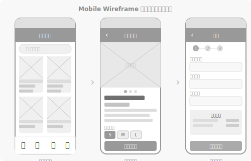
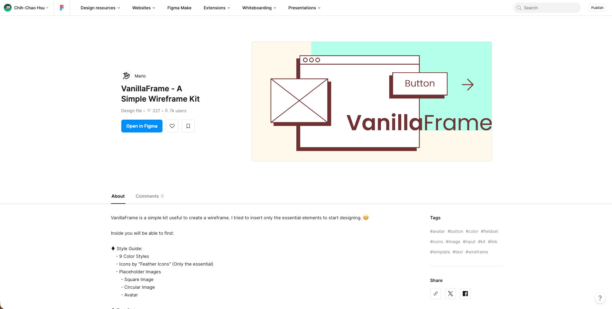

<!-- _class: lead -->
<!-- _paginate: false -->
<!-- _footer: "" -->

# 永續生活理念 UX/UI 設計實務
# Wireframe
許智超
<cchsu@mail.nsysu.edu.tw>

---
<!-- _class: lead -->

## 什麼是 Wireframe？

---

### 介面的「建築藍圖」

Wireframe（線框稿）是 UI 設計過程中最早期的視覺化工具，用簡單的線條、方塊與文字，描繪出一個介面的**結構布局**與**功能配置**，而不涉及顏色、字型或視覺風格。

就像建築師在蓋房子前，會先畫出平面草圖來確認房間的位置與動線——設計師在開始設計視覺之前，也必須先透過 Wireframe 確認資訊架構、功能邏輯是否正確。

---

### Wireframe 的核心問題

Wireframe 回答的是三個關鍵問題：

| 問題 | 說明 | 範例 |
| :--- | :--- | :--- |
| **放什麼？** | 這個頁面上要呈現哪些資訊與功能元件？ | 商品圖、價格、加入購物車按鈕 |
| **放在哪？** | 每個元件在畫面上的相對位置與優先順序 | 主圖在上方、行動按鈕置於顯眼位置 |
| **怎麼動？** | 使用者如何與介面互動、如何在頁面間流動 | 點擊按鈕後進入結帳流程 |

---

<!-- _class: pattern -->

### 設計流程中的位置

Wireframe 位於設計流程的核心環節，銜接「了解使用者需求」與「產出視覺設計」兩個階段。

**Wireframe 的五大價值：**
- 💡 快速驗證想法，避免方向錯誤
- 🔄 低成本迭代，修改不費工
- 👥 作為溝通媒介，對齊團隊認知
- 💰 節省開發成本，減少後期改動
- 🎯 聚焦功能邏輯，不分心於視覺

---

### Wireframe 設計的核心原則

**先思考結構，再考慮美觀**——Wireframe 的存在，是為了在投入大量設計資源之前，確認使用者需求與功能邏輯都已被妥善解決。

三個關鍵原則：

1. **越早畫，越快修**：Low-fi Wireframe 的修改成本幾乎為零，應大量產出後再收斂
2. **Wireframe 是溝通工具**：畫出來是為了讓整個團隊對齊，而不只是給自己看
3. **不要在 Wireframe 階段解決視覺問題**：把心力放在資訊架構與互動邏輯，美感留給 UI 設計階段

---

<!-- _class: lead -->

## Wireframe 的三種精細度

---

<!-- _class: pattern -->

### Low-Fidelity（低精細度）
- **形式**：最粗糙的手繪或數位草圖，以方塊與線條代替所有元件
- **目的**：快速驗證版面配置與資訊優先順序，不需細究任何細節
- **適合時機**：設計初期的發散思考，或與團隊快速對齊概念方向

Low-fi 的最大優點是速度快——快速做出不同版本，讓團隊有充分的空間討論。

---

<!-- _class: pattern -->

### Mid-Fidelity（中精細度）
- **形式**：加入實際文字標籤、元件名稱，版面配置更精確，但仍為灰階
- **目的**：傳達明確的互動邏輯與元件類型，讓工程師能夠理解功能需求
- **適合時機**：與開發團隊溝通規格，或進行可用性測試前的準備

Mid-fi 是最常用於「設計交接」的格式，能在不花費視覺設計時間的前提下，清楚傳達設計意圖。

---

<!-- _class: pattern -->

### High-Fidelity（高精細度）
- **形式**：接近最終設計稿，包含真實文字、色彩方案、圖示與精確間距
- **目的**：展示完整的視覺體驗，通常用於最終確認或使用者測試
- **適合時機**：設計評審、客戶簡報，或製作可互動原型（Prototype）

High-fi Wireframe 與 Prototype（原型）的界線往往模糊，通常在 Figma 中直接加上互動連結就成為可操作的原型。

---

<!-- _class: lead -->

## Wireframe 常用元素

---

<!-- _class: pattern -->

### 標準化的視覺語言

Wireframe 有一套約定俗成的符號語言，讓所有設計師與工程師都能看懂：

- **方塊 + 對角線**：圖片佔位符（Image Placeholder）
- **虛線方塊**：圖示佔位符（Icon）
- **填色方塊**：主要按鈕（Primary Button）
- **橫線**：文字內容區塊
- **空心輸入框**：表單欄位（Input Field）
- **麵包屑文字**：導覽路徑（Breadcrumb）
- **紅色框線 + 數字標籤**：設計標註（Annotation）

---

<!-- _class: lead -->

## Wireframe 模式範例

---

<!-- _class: pattern -->

### 標註式 Wireframe
- **核心功能**：在線框稿旁加入編號標籤與文字說明，讓工程師清楚了解每個元件的行為規格、狀態與互動邏輯。
- **互動方式**：以編號圓圈標記重要元件，搭配旁邊的說明列表對應解釋。
- **常見情境**：設計交接（Design Handoff）文件、規格書，或技術評審會議使用的簡報素材。

標註式 Wireframe 是設計師與工程師溝通的「翻譯媒介」，能大幅減少開發過程中的溝通成本。

---

<!-- _class: pattern -->

### 行動端 Wireframe
- **核心功能**：針對手機螢幕尺寸規劃介面流程，重視手指操作的觸控區域與單手操作的姿勢。
- **互動方式**：以多個手機畫面並排，呈現完整的使用者旅程，例如商品列表 → 商品詳情 → 結帳流程。
- **常見情境**：電商 App、社群平台、行動優先的響應式網站設計。

行動端 Wireframe 需特別注意「拇指可及區」，核心操作應落在畫面中下方。

---

### 元件資料庫

- [VanillaFrame - A Simple Wireframe Kit](https://www.figma.com/community/file/809361288503689329)

